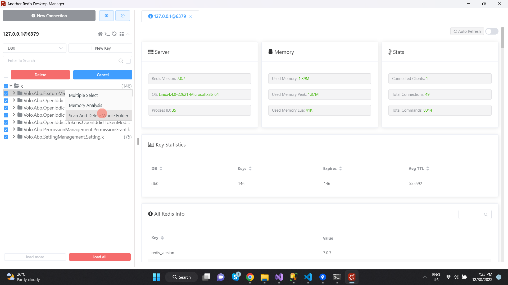

## WebBaseMono
web base theo mô hình monolihic gồn auth server dùng ABP Framework,.net 6 và angular 14

## Cài đặt
1. >Net 6 SDK: https://dotnet.microsoft.com/en-us/download/dotnet/6.0
2. Node.js <= 16.1: https://nodejs.org/en/
3. Angular/Cli 14
```
npm i -g @angular/cli@14
```
4. yarn
```
npm i -g yarn
```
5. Redis: https://redis.io/docs/getting-started/installation/install-redis-on-windows/
Nếu cài trên widow chạy nhân linux WSL2 thì cần cài:
- WSL2: https://learn.microsoft.com/en-us/windows/wsl/install
- Ubuntu: Window Store
6. Visual Studio 2022
7. Visual Studio Code
8. Sql Server 2019
9. ABP CLi:
```
dotnet tool install -g Volo.Abp.Cli
```
10. Công cụ quản lý redis AnotherRedisDesktopManager: https://gitee.com/qishibo/AnotherRedisDesktopManager/releases


## Môi trường dev
I. Chạy FE:
```
cd scr/angular
yarn
ng s -o --port 4201
```
II. Chạy BE:
1. Chạy redis sserver: mở ứng dụng Ubuntu
```
sudo service redis-server start
```
2. Fix lỗi không tháy thư viện
```
cd src\aspnet-core\src\WebBase.AuthServer
abp install-libs
```
3. Trong Visual Studio > tools > NUGet package manager
```
update-database
```
4. Chạy dự án DbMigrator để Seed data
5. Chạy setup run multi project
- AuthServer: 5101
- ApiHost: 5102
- Tài khoản: admin, mật khẩu: Admin@123

# Clear redis cache
```
redis-cli flushall
```
Dùng công cụ AnotherRedisDesktopManager

